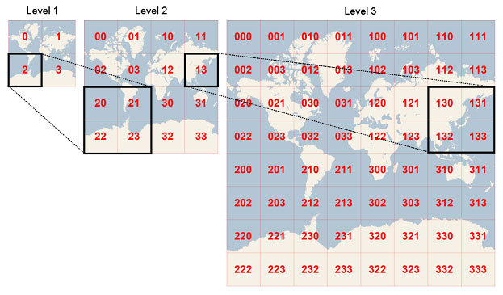

#### 地图编辑器

发现目前能搜索到的地图编辑只能在真实的地球地图上编辑，无法真正意义上的自定义底图，而我想要的是制作游戏地图那样的，给出具体地图设计图，然后可以在地图上编辑的功能。

#### 技术难点

* 瓦片缩放和缩放级别的映射
  * 由于要实现百度地图或高德地图的缩放效果，我们需要家里地图瓦片和具体缩放级别的对应关系，这样当我们缩放某个地图的时候，可以让这个地方更加清晰。
  * 在视口窗图上进行缩放，需要确定缩放的是具体缩放那一块的地图，这样才能准确获取这块地图的高清大图。这里需要设计算法。
* 地图上的资源定位
  * 不同的游戏可能需要在地图上定位的资源位置是不同的，所以需要为使用者提供需要定位资源的名称，资源的icon，资源的位置等信息。
  * 另外资源的定位位置，会随着缩放的不同，距离也会改变，这里要设计合理的动态位置延化算法。
* 数据的存储和传输
  * 瓦片图的添加，资源的映射等如何设计，另外地图的导入和编辑数据结构的设计。
* 更丰富的动态效果(以后再说)
  * 资源柱状图
  * 热力图
  * 3D的模型


#### 瓦片缩放和缩放级别映射

这里，我们统一将**tile**成为**瓦片**，方便理解点。

首先一个问题是，我们将一张图片进行切割成多个瓦片的规则是什么。这里我直接做一个总结。

当我们拿到一张地图的完整设计稿，以左上角建立直角坐标系，当然下面这种并不是完全规则直角坐标系，能理解就好，其实就是将每个坐标来标记每个瓦片地图的位置，这对之后的放大缩小有很大的帮助，还有资源的标记等。

那么坐标的数值范围如果规定呢？这取决于你要设定的多少级别的缩放等级。

举个例子，如果你准备总有三级的放大效果，那么你的坐标范围就是从(0,0)->(2^level-1,2^level-1)的范围，还是以下面的地图举例的话，那么就是从(0,0)到(7,7)，且保证你的每块地图大小都必须是256*256像素大小的正方形小块。


所以就有这样一个公式，已知一个像素的XY坐标时候，我们很容易得到这个像素所在的瓦片的XY坐标

```
tileX = floor(pixelX/256) tileY = floor(pixelY/256) 
```

所以同理，当缩放等级是1时，要求每片瓦片大小为`256*256`，缩放等级为2时候，每张瓦片的大小应该是`512*512`，3时，为`1024*1024`，以此类推。缩放等级和每张瓦片的大小关系为`(level*256,level*256)`同时为了加快请求速度，缩放等级越低，他的图质量，也就是体积该越小，缩放越大，质量应该越高，越清楚。

> 是否要提供切割大图的功能，传入一张大图，将他切割成1-3级的内容。但是要严格规定传入的图片尺寸。

这里有个优化的点，由于我们的放大操作，可以理解成将某个区域替换成清晰度更高的操作，所以把一张图放大后如何**对应这个位置的更高清的周围图**的方法，就需要一个映射关系。

同时为了简化索引和存储地图图片，每个瓦片的二维`XY`值被转换成一维字串，即四叉树键值（`quardtree key`，简称`quadkey`）。每个`quadkey`独立对应某个放大级别下的一个瓦片，并且它可以被用作数据库中B-tree索引值。为了将坐标值转换成`quadkey`，需要将Y和X坐标二进制值交错组合，并转换成4进制值及对应的字符串。例如，假设在放大级别为3时，`tile`的`XY`坐标值为（3，5），`quadkey`计算如下。

```
首先，我们分别将3，和5转化成二进制数目
tileX = 3 = 011 (二进制)
tileY = 5 = 101 (二进制)
然后我们将这两个二进制交错组合，形成新的二进制
```


```
这样，我们获得了新的二进制，这就是我们的quardtree key，也就是四叉树键值。
quadkey = 100111 (二进制)
接着，我们再将他转化为4进制
100111 = 213 (四进制)
这样，我们就获得了一串新的字符串。我们将这些经过转换的值，从坐标替换到quadkey。于是我们得到了新的坐标。
```



`quadkey`还有其他一些有意思的特性。

* `quadkey`的长度等于该瓦片所对应的放大级别。
* 每个瓦片的`quadkey`的前几位和其父瓦片（上一放大级别所对应的瓦片）的`quadkey`相同；上图中，瓦片 2是瓦片 20至23的父瓦片，瓦片 13是瓦片 130至133的父瓦片。

这样存储到数据库的时候，要**索引周围的图片**速度会大大提升。

定义好了地图之间的映射关系，我们来设计一下**视口**的大小，也就是我们用来查看地图的窗口大小，很明显的是作为窗口，我们要判断窗口具体落到了地图的哪个位置，依据就是窗口的四个角的坐标，通过四个角的坐标演算来判断他们具体落到了哪里。所以我们需要将`html`元素的长宽高和像素对应起来，这样才可以得到准确的坐标。


如果一个瓦片按照我们的规定为`256*256`的大小，且我们的窗口长宽为`100*100`，窗口的大小和视口一模一样，即每次鼠标移动一个单位相当于移动了`256/100=2.56`个像素点，而我们知道了像素点转化为`xy`坐标的方法

```
tileX = floor(pixelX/256) tileY = floor(pixelY/256) 
```

由此，加载出该图片。

这里我个人有个优化的建议，视口的最好小于一个正常瓦片的大小，这样不会**因为稍微移动一下，就需要加载图片**，而是**需要移动操作**才可以加载。


最后在初始化的时候，设计两个XY值得全局变量，用来记录窗口的移动变化，借此算出其他三个角的坐标，然后加载地图。